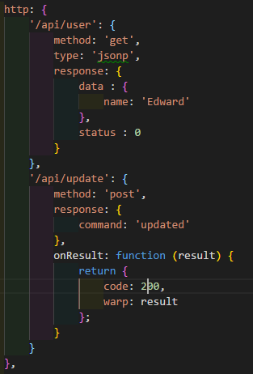
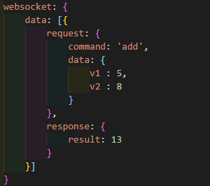
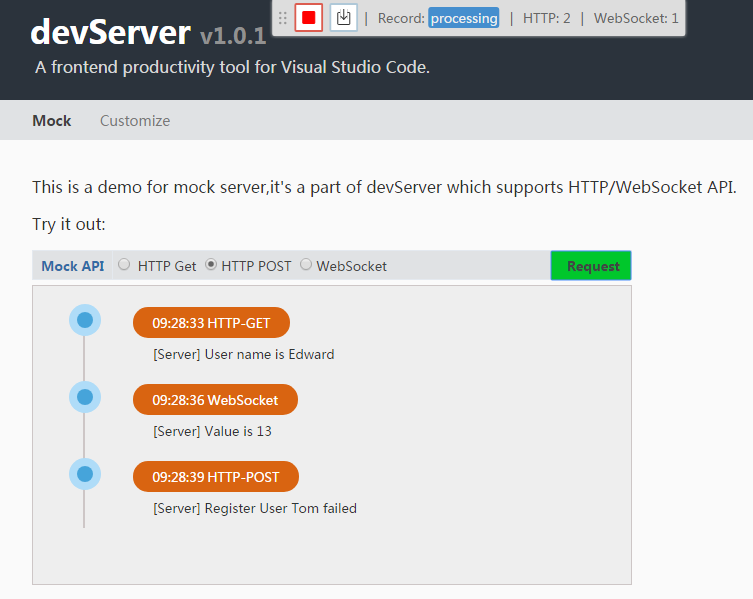

# README

developmentServer is a productivity tool for frontend to improve product development efficiency.

## Features

- lightweight webServer for vs code  
  

- livereload  
  Auto refresh browser when js/css/html file updated.

- mock server  
  As local mock server for developer  
  * support HTTP Web API
    > declare "http" section in mock file  
    

  * support websocket API
    > declare "websocket" section in mock file  
    

- record toolbar  
  It can record and download response data after real request,support xmlhttprequest and websocket.So user can easy generate mock file.  
  

## How to customize
  TODO

## Sample
>Use VS Code open the [Sample](https://github.com/ihuke/developmentServer/sample)  

## Author

[huke](email:ihuke@126.com)