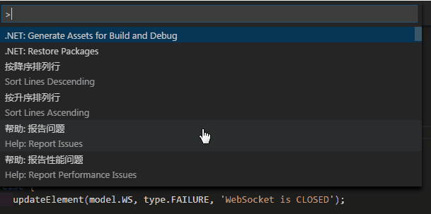
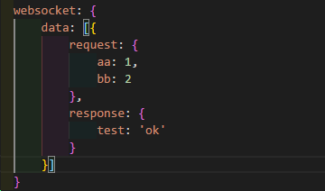

# README

developmentServer is a productivity tool for frontend to improve product development efficiency.

## Features

- lightweight webServer for vs code
  

- livereload when file(js/css/html/less/sass/scss) updated

- automatically generate .css file for less/sass/scss

- mock http data server for test
  > declare mock file in devServer.json file
  
  

- mock websocket data server for test
    

- record and generate mock data on real request/response,support http and websocket

## Sample
[Use vsCode open the Sample site and use command: 'devServer: Start'](https://github.com/ihuke/devServerSample)

## Author

[huke](email:ihuke@126.com)